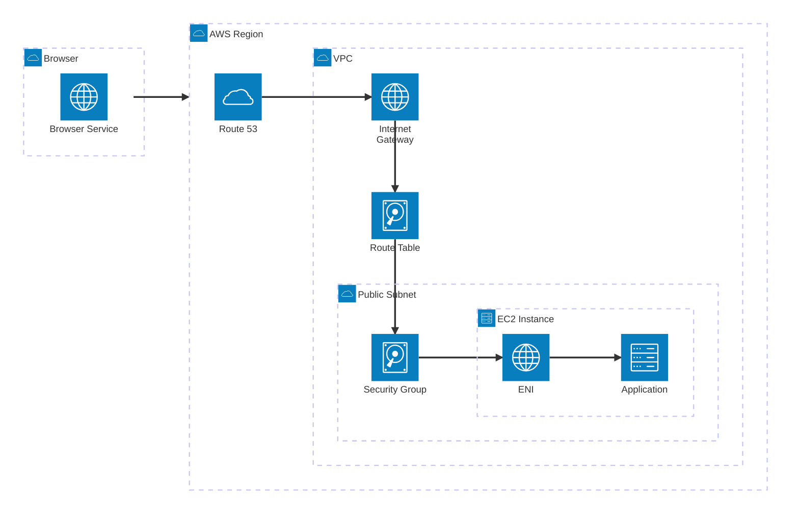

# 🌏 woowa-network

## 👀 App
- [Goto Roomescape](http://43.202.2.142:8080)

## ❓ Keywords

| 개념 | 한 줄 정리 |
|---|---|
| AWS Region | AWS 데이터센터들이 위치한 지리적 묶음 |
| VPC | AWS 안에서 내가 따로 만든 전용 네트워크 공간 |
| Subnet | VPC를 더 작게 나눈 네트워크 구역 |
| Amazon Route 53 | 도메인 이름을 IP 주소로 연결해주는 DNS 서비스 |
| Application Process | EC2 안에서 실제로 실행 중인 애플리케이션 프로그램 |
| Browser | 사용자가 서비스를 요청하고 응답을 받는 클라이언트 프로그램 |
| Instance | AWS에서 빌려 쓰는 가상 서버 |
| ENI | EC2에 연결되는 가상 네트워크 카드 |
| Internet Gateway | VPC가 인터넷과 통신할 수 있게 해주는 출입문 |
| Route Table | 목적지 IP에 따라 트래픽이 어디로 가야 하는지 정하는 경로표 |
| Security Group | EC2나 ENI 앞에서 인바운드·아웃바운드 트래픽을 제어하는 방화벽 |

## 🗒️ passports

### request

| request | response |
|---|---|
|  |  |
